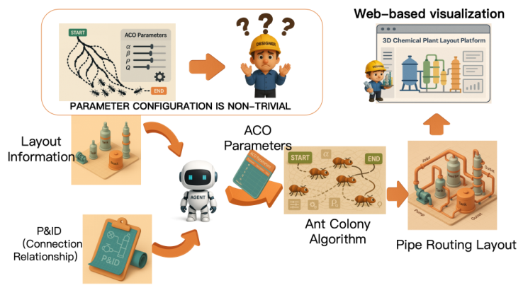
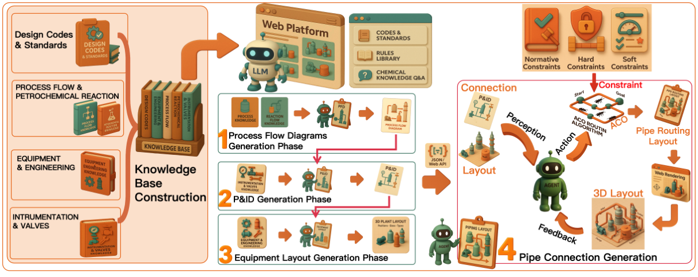
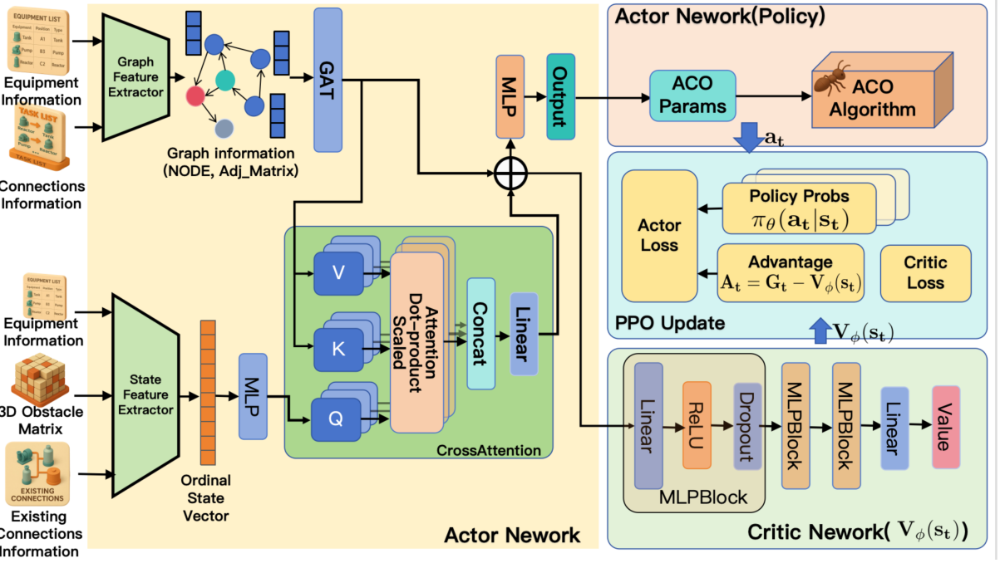
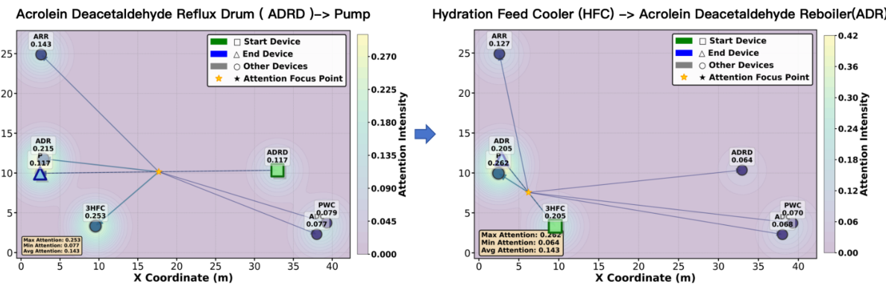
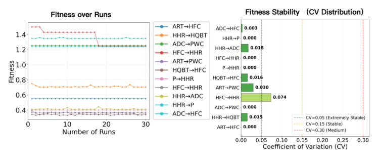
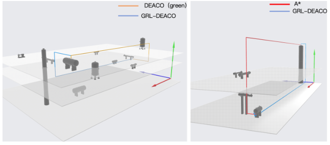

# Framework Overview

This document references the original figures from the WWW 2026 paper rather than redrawing the framework. The PNG assets were cropped from the paper PDF and stored under `docs/assets/paper_figures/` for public documentation.

## Problem Motivation

**Figure 1.** Configuring ACO hyperparameters is non-trivial in complex multi-connection scenes, whereas a reinforcement learning agent can adapt them to each context, reducing design effort and improving path quality.

## Web Platform Workflow

**Figure 2.** Functional architecture and workflow of the petrochemical agent web platform.

## GRL-DEACO Actor-Critic Framework

**Figure 3.** GRL-DEACO actor-critic architecture with graph-aware perception. This is the main framework figure for the public implementation: `piping/graph_neural_networks.py`, `piping/ppo_trainer.py`, `piping/environment.py`, and `piping/deaco/` implement the graph-aware policy, action mapping, PPO update, and DEACO-Green routing loop shown in the figure.

## Attention and Evaluation Figures

**Figure 4.** Cross-attention over the 2D layout for two consecutive routing tasks.

**Figure 5.** Fitness stability of the ACO environment over repeated runs and coefficient-of-variation statistics.

**Figure 6.** Elevation behavior comparison across scenarios.

## Traceability Pointers

- Scene and GLB IO: `piping/deaco/layout_io.py`, `piping/deaco/glb_reader.py`, `piping/deaco/glb_cache.py`
- Grid and obstacles: `piping/deaco/grid.py`, `piping/voxel_box_approximation.py`
- DEACO search: `piping/deaco/aco.py`
- Green fitness: `piping/deaco/fitness.py`
- Scene routing: `piping/deaco/routing.py`
- RL state/action/reward: `piping/state.py`, `piping/ppo_trainer.py`, `piping/reward.py`
- Training and evaluation entry points: `piping/train.py`, `piping/evaluate_deaco_with_params.py`, `piping/evaluate_trained_policy.py`
